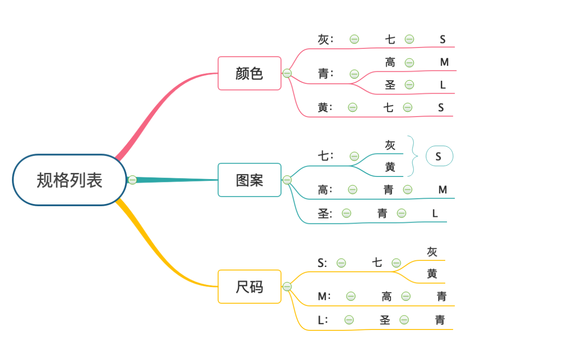

# SKU

> SKU (stock keeping unit):存货单位/库存单元，定义为库存管理中的最小可用单元

[前端SKU算法的实现](https://juejin.im/post/5dc81ea36fb9a04a6f0fec28?utm_source=gold_browser_extension#heading-0)

## 含义

维基百科称SKU为存货单位，那代表的也应该是一个单位，不是具的数量，就像`cm、m、km、元、角、分、件、箱`一样，cm不是1cm也不是10cm。它也有单位所拥有的特征

这是某东macbook pro产品页的截图，红色框内有两个属性选择颜色和选择版本,只有两个属性分析起来也是比较简单的了。我们来看看SKU是个什么样的单位,这里任意的颜色与版本组合就是一个单位（SKU），比如这里默认给我选了一个单位（SKU）颜色：`19款13.3英寸 i5 8+256G灰 RP64519款13.3英寸 i5 8+256G灰 RP645 + 版本：普通版`。我们暂且把这一选项称为SKU1,来尝试这样跟我说给我来一(SKU1)的macboook pro,就代表给我来一个颜色为`19款13.3英寸 i5 8+256G灰 RP64519款13.3英寸 i5 8+256G灰 RP645 + 版本为普通版`的macboook pro。

是不是有点感觉？这些属性的不同组合就可以代表一种具体规格的商品，而这种具体规格就是一个SKU。可以总结为一个很傻的公式给我来一SKU XX商品，将某种规格代入SKU的位置，将商品名称代入XX。这就很容易理解了。我们现在来算算这个产品有多少种SKU：当前这个产品总共有14种颜色，2种版本，就有`14 * 2 = 28种SKU`。

### SPU

> SPU ( Standard Product Unit )：标准产品单位，它是是大多数在线商店或电子商务使用的最小产品信息单位。

其实这产品中的MacBook Pro 13.3，或者更详细一点，这个词可以代表我们要找的一类商品，这就是SPU，MacBook Pro 13.3就是一个产品信息，说SPU是产品信息的单位就可以理解了。

## 算法实现

举例：
如上表中，确定了颜色是灰色，就去遍历其他种类的规格（图案和尺码），遍历图案的时候，只用知道七龙珠跟我匹配，其余不匹配的全部置灰，遍历尺码的时候，只要知道小号 S跟我匹配，其他一律置灰。
再选图案，就只能选七龙珠，选了七龙珠之后，再去遍历其他种类的规格，颜色中只有青芒色跟金属灰可以跟我匹配，其他全部置灰。
再选尺码，只能选S了，根据上述规则，再去置灰其他两种规格中不匹配的。

找到与需求结合的数据结构，进行现有数据的数据结构转变，**将组合问题数据结构化**，就可以清晰明了的使用了。
