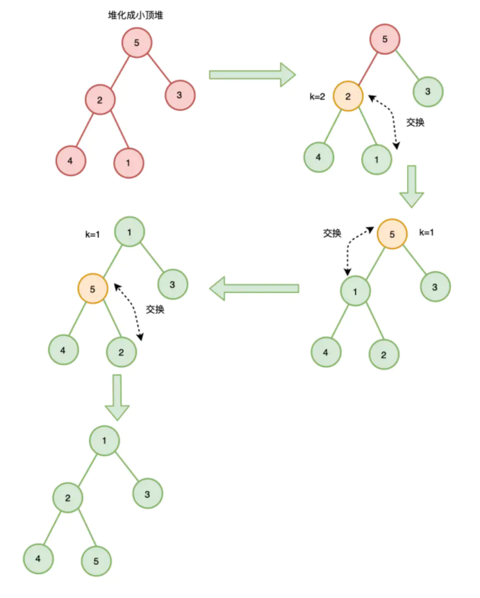

# heap堆

> 堆是一个完全二叉树，堆上的任意节点值都必须大于等于（大顶堆）或小于等于（小顶堆）其左右子节点值

- 如果堆上的任意节点都大于等于子节点值，则称为 **大顶堆**
- 如果堆上的任意节点都小于等于子节点值，则称为 **小顶堆**

## 创建

常用的方式有两种：

- 插入式创建：每次插入一个节点，实现一个大顶堆（或小顶堆）
- 原地创建：又称堆化，给定一组节点，实现一个大顶堆（或小顶堆）

### 插入式

- 将节点插入到队尾
- 自下往上堆化： 将插入节点与其父节点比较，如果插入节点大于父节点（大顶堆）或插入节点小于父节点（小顶堆），则插入节点与父节点调整位置
- 一直重复上一步，直到不需要交换或交换到根节点，此时插入完成

```js
const heaps = [];

function insert(key) {
    heaps.push(key)
    // 获取存储位置
    let i = heaps.length - 1
    while (i/2 > 0 && heaps[i] > heaps[i/2]) {  
        swap(heaps, i, i/2); // 交换
        i = i/2;
    }
}  
function swap(items, i, j) {
    let temp = items[i]
    items[i] = items[j]
    items[j] = temp
}

```

### 原地建堆

- 自下而上式堆化 ：将节点与其父节点比较，如果节点大于父节点（大顶堆）或节点小于父节点（小顶堆），则节点与父节点调整位置
- 自上往下式堆化 ：将节点与其左右子节点比较，如果存在左右子节点大于该节点（大顶堆）或小于该节点（小顶堆），则将子节点的最大值（大顶堆）或最小值（小顶堆）与之交换



```js
// 原地建堆 小顶堆
function buildHeap(items, heapSize) {
    while(heapSize < items.length - 1) {
        heapSize ++
        heapify(items, heapSize)
    }
}

function heapify(items, i) {
    // 自下而上式堆化
    while (Math.floor(i/2) > 0 && items[i] < items[Math.floor(i/2)]) {  
        swap(items, i, Math.floor(i/2)); // 交换
        i = Math.floor(i/2);
    }
}  

function swap(items, i, j) {
    let temp = items[i]
    items[i] = items[j]
    items[j] = temp
}

// 测试
var items = [,5, 2, 3, 4, 1]
// 初始有效序列长度为 1
buildHeap(items, 1)
console.log(items)
// [empty, 1, 2, 3, 5, 4]

```

### 保持住队的“大顶”结构特性

> 反复向下对比+交换的过程

**“删除”就是“向下比较+交换”，而“添加”则是“向上比较+交换”**。

```js
// 入参是堆元素在数组里的索引范围，low表示下界，high表示上界
function downHeap(low, high) {
    // 初始化 i 为当前结点，j 为当前结点的左孩子
    let i=low,j=i*2+1
    // 当 j 不超过上界时，重复向下对比+交换的操作
    while(j <= high) {
        // 如果右孩子比左孩子更大，则用右孩子和根结点比较
        if(j+1 <= high && heap[j+1] > heap[j]) {
            j = j+1
        }

        // 若当前结点比孩子结点小，则交换两者的位置，把较大的结点“拱上去”
        if(heap[i] < heap[j]) {
            // 交换位置
            const temp = heap[j]  
            heap[j] = heap[i]  
            heap[i] = temp

            // i 更新为被交换的孩子结点的索引
            i=j  
            // j 更新为孩子结点的左孩子的索引
            j=j*2+1
        } else {
            break
        }
    }
}
```
