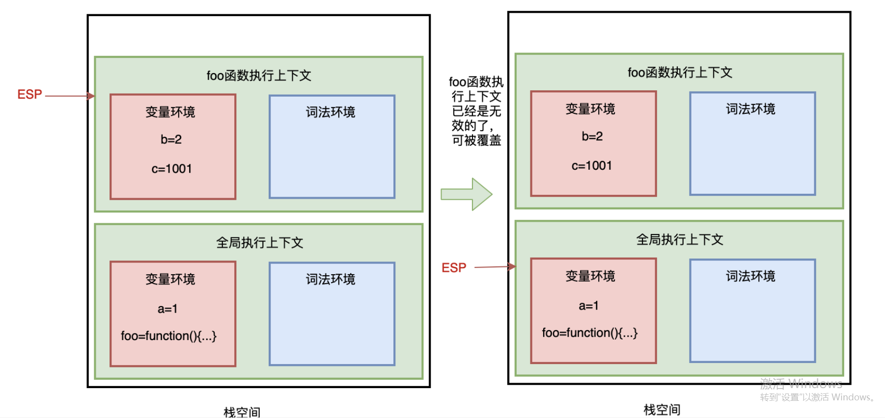

# 栈 stack

> 栈是一种遵从后进先出 (LIFO / Last In First Out) 原则的有序集合

**参考**:

- [全方位解读前端用到的栈结构](https://juejin.im/post/6844904134341033998)

栈的操作主要有： push(e) (进栈)、 pop() (出栈)、 isEmpty() (判断是否是空栈)、 size() (栈大小)，以及 clear() 清空栈，具体实现也很简单

```js
function Stack() {
  let items = []
  this.push = function(e) {
    items.push(e)
  }
  this.pop = function() {
    return items.pop()
  }
  this.isEmpty = function() {
    return items.length === 0
  }
  this.size = function() {
    return items.length
  }
  this.clear = function() {
    items = []
  }
}

```

- 查找：从栈头开始查找，时间复杂度为 O(n)
- 插入或删除：进栈与出栈的时间复杂度为 O(1)

## JS运行机制

> 单线程解释执行，为了避免操作DOM冲突，同时为了避免长任务堵塞，任务分为异步、同步

**同步任务**都在主线程（这里的主线程就是 JavaScript 引擎线程）上执行，会形成一个 调用栈 ，又称 **执行栈**

除了主线程外，还有一个任务队列（也称**消息队列，存放的是异步任务的事件回调**），用于管理异步任务的 事件回调 ，在 调用栈 的任务执行完毕之后，系统会检查任务队列，看是否有可以执行的异步任务

```js
setTimeout(() => {
    console.log('时间到')
}, 1000)
```

setTimeout 本身是同步执行的，放入任务队列的是它的回调函数。

## 调用栈

> 调用栈就是用来管理函数调用关系的一种栈结构 。

**调用栈是 JavaScript 用来管理函数执行上下文的一种数据结构，它记录了当前函数执行的位置，哪个函数正在被执行**。 如果我们执行一个函数，就会为函数创建执行上下文并放入栈顶。 如果我们从函数返回，就将它的执行上下文从栈顶弹出。 也可以说调用栈是用来管理这种执行上下文的栈，或称执行上下文栈（执行栈）

```js
// 栈溢出
function add() {
  return 1 + add()
}

add()
```

避免栈溢出，**先写边界条件**，`console.trace()`获取调用信息

## JS内存

> 栈（基本类型、引言类型地址）与堆（引用类型数据）

- 代码空间：主要用来存放可执行代码
- 栈空间：调用栈的存储空间就是栈空间。
- 堆空间

### 栈空间

基本类型在内存中占有固定大小的空间，所以它们的值保存在栈空间，我们通过 按值访问 。

一般栈空间不会很大

### 堆空间

引用类型，值大小不固定，但指向值的指针大小（内存地址）是固定的，所以把对象放入堆中，将对象的地址放入栈中，这样，在调用栈中切换上下文时，只需要将指针下移到上个执行上下文的地址就可以了，同时保证了栈空间不会很大。
当查询引用类型的变量时， 先从栈中读取内存地址， 然后再通过地址找到堆中的值。对于这种，我们把它叫做**按引用访问**。

一般堆内存空间很大，能存放很多数据，但它内存分配与回收都需要花费一定的时间

基本类型（栈空间）与引用类型（堆空间）的存储方式决定了：**基本类型赋值是值赋值，而引用类型赋值是地址赋值**。

### 垃圾回收

> JavaScript 中的垃圾数据都是由垃圾回收器自动回收的，不需要手动释放



JavaScript 引擎通过向下移动 ESP 指针来销毁存放在栈空间中的执行上下文

- 标记： 标记堆空间中的活动对象（正在使用）与非活动对象（可回收）
- 垃圾清理： 回收非活动对象所占用的内存空间
- 内存整理： 当进行频繁的垃圾回收时，内存中可能存在大量不连续的内存碎片，当需要分配一个需要占用较大连续内存空间的对象时，可能存在内存不足的现象，所以，这时就需要整理这些内存碎片。

**增量标记**:

V8 浏览器会自动执行垃圾回收，但由于 JavaScript 也是运行在主线程上的，一旦执行垃圾回收，就要打断 JavaScript 的运行，可能会或多或少的造成页面的卡顿，影响用户体验，所以 V8 决定采用增量 标记算法回收：
即把垃圾回收拆成一个个小任务，穿插在 JavaScript 中执行。
