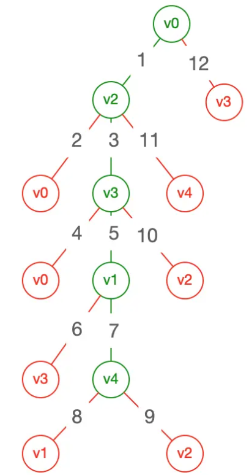

# Tree

[生成tree](https://github.com/LeuisKen/leuisken.github.io/issues/2)
[数据结构算法——tree](https://lewis617.github.io/2017/02/18/tree/)

## 遍历

- dfs(深度优先): 1,2,4,8,5,3,6,7

- bfs(广度优先): 1,2,3,4,5,6,7,8

## 二叉树

> 每个节点最多只有两个分支（即不存在分支度大于2的节点）的树结构.

- 前序遍历(Pre-order Traversal): A->B->C，先访问父节点A
- 中序遍历(In-order Traversal): B->A->C, 先访问A的左子树，再访问A, 再访问A的右子树
- 后序遍历(Post-order Traversal): B->C->A 最后访问父节点A
