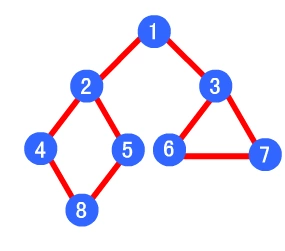
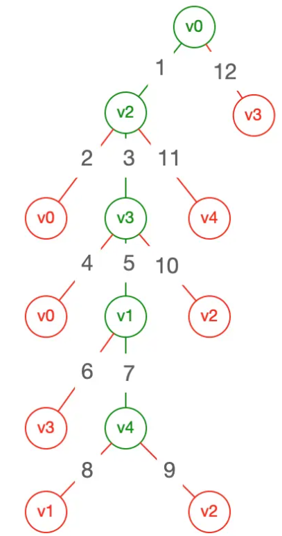
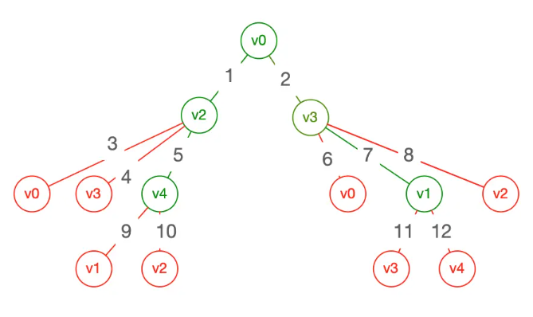

# Tree

[生成tree](https://github.com/LeuisKen/leuisken.github.io/issues/2)
[数据结构算法——tree](https://lewis617.github.io/2017/02/18/tree/)

## 遍历

- dfs(深度优先): 1,2,4,8,5,3,6,7

- bfs(广度优先): 1,2,3,4,5,6,7,8

