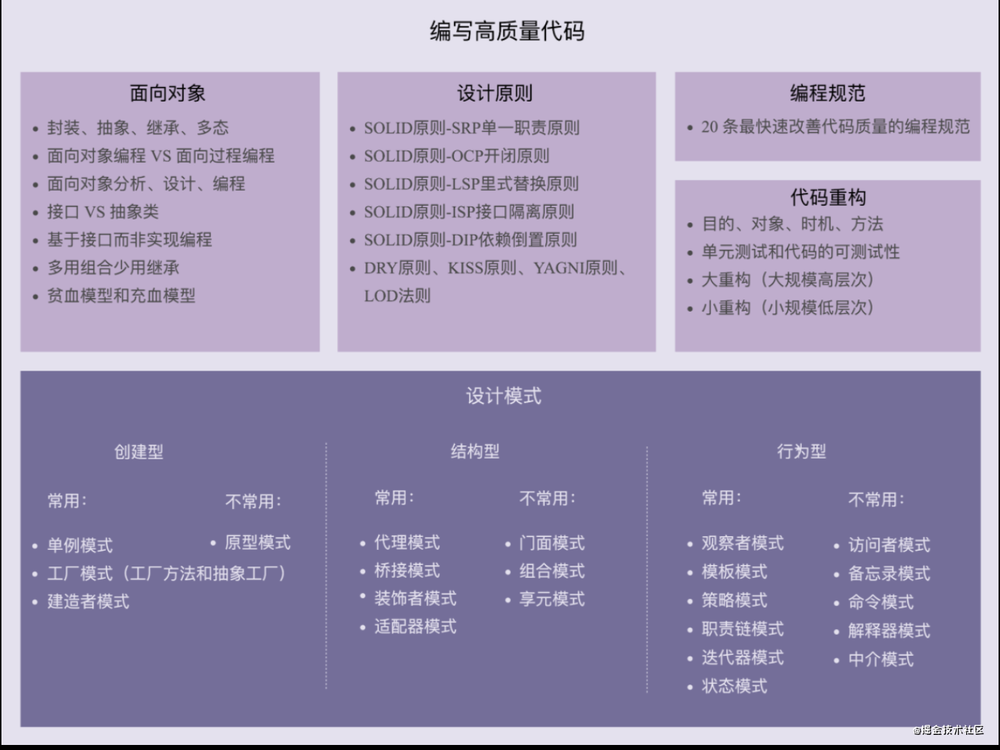

# 编程设计

> 记录、学习设计模式、编程模式

## 前言

JavaScript设计模式的作用 - 提高代码的重用性，可读性，使代码**可解耦, 可扩展性, 可靠性, 条理性, 可复用性**, 降低软件开发的复杂度，让迭代的难度保持在合理区间内.

- 1.单体模式，工厂模式，桥梁模式个人认为这个一个优秀前端必须掌握的模式，对抽象编程和接口编程都非常有好处。

- 2.装饰者模式和组合模式有很多相似的地方，它们都与所包装的对象实现同样的接口并且会把任何方法的调用传递给这些对象。装饰者模式和组合模式是本人描述的较吃力的两个模式，我个人其实也没用过，所以查了很多相关资料和文档，请大家海涵。

- 3.门面模式是个非常有意思的模式，几乎所有的JavaScript库都会用到这个模式，假如你有逆向思维或者逆向编程的经验，你会更容易理解这个模式（听起来有挑战，其实一接触你就知道这是个很简单的模式）；还有配置器模式得和门面模式一块拿来说，这个模式对现有接口进行包装，合理运用可以很多程度上提高开发效率。这两个模式有相似的地方，所以一块理解的话相信都会很快上手的。

- 4.享元模式是一种以优化为目的的模式。

- 5.代理模式主要用于控制对象的访问，包括推迟对其创建需要耗用大量计算资源的类得实例化。

- 6.观察者模式用于对对象的状态进行观察，并且当它发生变化时能得到通知的方法。用于让对象对事件进行监听以便对其作出响应。观察者模式也被称为“订阅者模式”。

- 7.命令模式是对方法调用进行封装的方式，用命名模式可以对方法调用进行参数化和传递，然后在需要的时候再加以执行。

- 8.职责链模式用来消除请求的发送者和接收者之间的耦合。

## 设计原则

- 可扩展性--我是否需要不断地重构代码来支持额外的功能？
- 易模块化--如果我更改了一个文件，另一个文件是否会受到影响？
- 可重用性--是否有很多重复的代码？
- 可测性--给这些函数添加单元测试是否让我纠结？
- 易推理性--我写的代码是否非结构化严重并难以推理？
- 可读性--接触代码人员都能看懂



### SOLID

- 单一功能职责：小而美，高内聚，低耦合
- 开闭原则：对外扩展开放，对内封闭修改
- 里氏替换原则：子类在设计的时候，要遵守父类的行为约定
- 接口隔离原则：接口的调用者或者使用者，不应该强迫依赖它不需要的接口
- 依赖反转(倒置)原则：高层模块（ high-level modules ）不要依赖低层模块（ low-level ）。高层模块和低层模块应该通过抽象（ abstractions ）来互相依赖。除此之外，抽象（ abstractions ）不要依赖具体实现细节（ details ），具体实现细节 （ details ）依赖抽象（ abstractions ）。

### KISS

> 保持代码简单，降低复杂度

一些较长的正则表达式，三位运算符，这些都是违背了 KISS 原则

### DRY

> 不用重复

抽取封装重复代码逻辑，减少代码耦合、满足单一职责原则、模块化、业务与非业务逻辑分离、通用代码抽离、抽象和封装、使用设计模式

### LOD

> 高内聚，低耦合

不该有直接依赖关系的类之间，不要有依赖。有依赖关系的类之间，尽量只依赖必要的接口

## 灵活的JS

> 各模式间可以相互组合使用

案例需求：表单验证：用户名、邮箱、密码等

1、**函数校验**

```js
function checkName () {}
function checkEmail () {}
function checkPwd () {}
```

全局变量污染，极易被覆盖。

2、**对象收编**

```js
var checkObj = {
  checkName: function () {},
  checkEmail: function () {},
  checkPwd: function () {}
}
```

3、对象复用

> 不彼此影响

```js
// 返回对象
var checkObj = function () {
  return {
    checkName: function () {},
    checkEmail: function () {},
    checkPwd: function () {}
  }
}

var a = checkObj();
```

4、类创建

> 类创建方式，新对象实例化与原对象无关联

```js
// 返回对象
var checkObj = function () {
  this.checkName = function () {}
  this.checkEmail = function () {}
  this.checkPwd = function () {}
}

var a = new checkObj();
```

每个实例化对象都有一套自己的方法，消耗大

5、原型继承

> 共用一套原型方法

```js
// 原型
var checkObj = function () {
}

checkObj.prototype = {
  checkName: function () {return this;},
  checkEmail: function () {return this;},
  checkPwd: function () {return this;}
}

// 防止被新对象覆盖
checkObj.prototype.checkName = function () {return this;}

var a = new checkObj();
a.checkName().checkEmail().checkPwd();
```

6、链式调用

> `return this`

```js
// 原型
var checkObj = function () {
}

checkObj.prototype = {
  checkName: function () {},
  checkEmail: function () {},
  checkPwd: function () {}
}

// 防止被新对象覆盖
checkObj.prototype.checkName = function () {}

var a = new checkObj();
a.checkName();
a.checkEmail();
a.checkPwd();
```

7、祖先抽象添加

> 对 `Object`, `Function` 等进行最小限度的污染添加

```js
Function.prototype.addCheck = function (name, fn) {
  this[name] = fn;
  return this;
}
var check = new Function();

check.add('checkName', function () {return this;}).add('checkEmail', function () {return this;});

check.checkName().checkEmail();

// 类调用
var m = new check();
m.checkName(),checkEmail();
```

## 参考

> GOF提出的23种设计模式, 需要详细查看见  [Learning JavaScript Design Patterns](https://addyosmani.com/resources/essentialjsdesignpatterns/book/)

- [常用的Javascript设计模式](http://blog.jobbole.com/29454/)
- [js设计模式](http://www.cnblogs.com/Darren_code/archive/2011/08/31/JavascripDesignPatterns.html)
- [极客学院 设计模式](http://wiki.jikexueyuan.com/project/javascript-design-patterns/)
